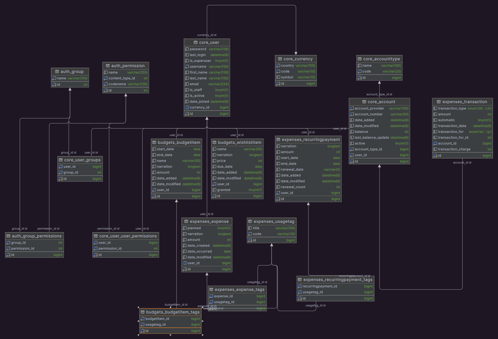

# Tyne Finance DB
This is the DB for Tyne Finance Application.
Found [here](https://github.com/muremwa/Tyne-Finance "Tyne Finance Python (Django)") or [here](https://github.com/muremwa/tyne-finance-jvm "Tyne Finance Java (Spring)").

The structure is as in the image below:
